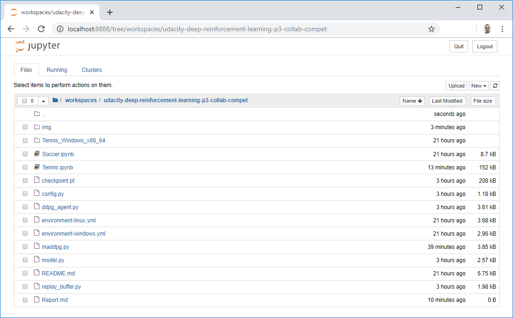
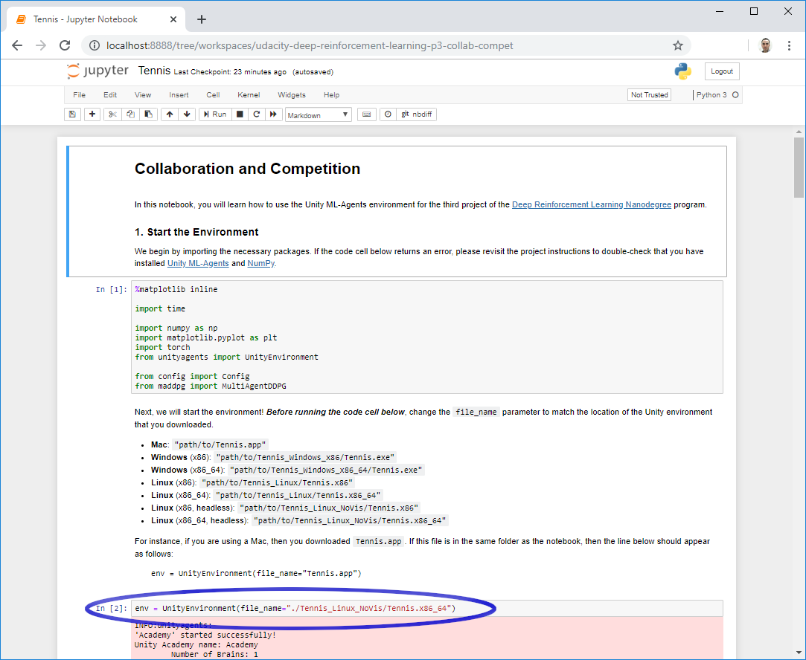
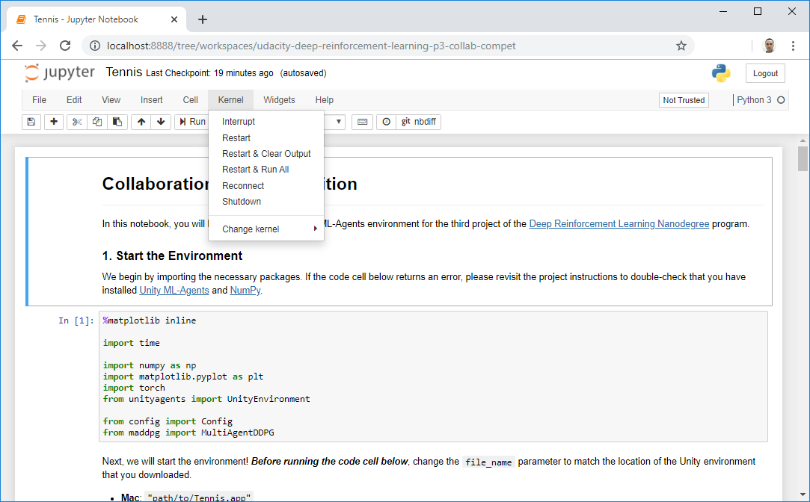

# Project 3: Collaboration and Competition

## Introduction  
This project is part of the [Deep Reinforcement Learning Nanodegree Program](https://www.udacity.com/course/deep-reinforcement-learning-nanodegree--nd893), by Udacity.  

The goal in this project is to train two agents controlling rackets to bounce a ball over a net.  
  

## Understanding the environment  
This environment has been built using the **Unity Machine Learning Agents Toolkit (ML-Agents)**, which is an open-source Unity plugin that enables games and simulations to serve as environments for training intelligent agents. You can read more about ML-Agents by perusing the [GitHub repository](https://github.com/Unity-Technologies/ml-agents).  

The project environment provided by Udacity is similar to, but not identical to the Tennis environment on the  [Unity ML-Agents GitHub page](https://github.com/Unity-Technologies/ml-agents/blob/master/docs/Learning-Environment-Examples.md#tennis).  

In this environment, two agents control rackets to bounce a ball over a net. If an agent hits the ball **over the net**, it receives a reward of **+0.1**.  If an agent lets a ball **hit the ground** or hits the ball **out of bounds**, it receives a reward of **-0.01**.  Thus, the goal of each agent is to keep the ball in play.

#### State and action spaces  
The observation space consists of **8 variables** corresponding to the position and velocity of the ball and racket. Each agent receives its own, local observation.  
In order to keep track of multiple observations into the past, this environment **stacks 3 vector observations**, so they may be compared over the time. Thus, each agent receives a vector of observation containing **24 variables**.

**Two continuous actions** are available, corresponding to movement toward (or away from) the net, and jumping. 

#### Solving the environment  
The task is episodic, and in order to solve the environment, your agents must get an average score of **+0.5** over 100 consecutive episodes, after taking the maximum over both agents. Specifically,  

* After each episode, we add up the rewards that each agent received (without discounting), to get a score for each agent. This yields 2 (potentially different) scores. We then take the maximum of these 2 scores.
* This yields a single **score** for each episode.
* The environment is considered solved, when the **average** (over 100 episodes) of those scores is at least +0.5.  


## Included in this repository

* The code used to create and train the Agent
 * Tennis.ipynb - notebook containing the challenge for this project
 * maddpg.py - code to train a Multi Agent DDPG
 * ddpg_agent.py - code for each DDPG Agent
 * model.py - the neural network which serves as the function approximator to the DDPG Agent
 * replay_buffer.py - buffer where experiences are stored in and recovered from
 * config.py - class containing the adjustable parameters
 * Soccer.ipynb - notebook containing an extra challenge (not developed in this project), where the goal is to train a team of agents to play soccer
* The trained model
 * checkpoint.pt
* Files describing all the packages required to set up the environment
 * for Linux: environment-linux.yml
 * for Windows: environment-windows.yml
* The Report.md file describing the development process and the learning algorithm, along with ideas for future work
* This README.md file

## Setting up the environment

This section describes how to get the code for this project, configure the local environment, and download the Unity environment with the Agents.

### Getting the code
You have two options to get the code contained in this repository:
##### Option 1. Download it as a zip file

* [Click here](https://github.com/silviomori/udacity-deep-reinforcement-learning-p3-collab-compet/archive/master.zip) to download all the content of this repository as a zip file
* Decompress the downloaded file into a folder of your choice

##### Option 2. Clone this repository using Git version control system
If you are not sure about having Git installed in your system, run the following command to verify that:

```
$ git --version
```
If you need to install it, follow [this link](https://git-scm.com/downloads) to do so.

Having Git installed in your system, you can clone this repository by running the following command:

```
$ git clone https://github.com/silviomori/udacity-deep-reinforcement-learning-p3-collab-compet.git
```  

### Installing Miniconda
Miniconda is a free minimal installer for conda. It is a small, bootstrap version of Anaconda that includes only conda, Python, the packages they depend on, and a small number of other useful packages, including pip, zlib, and a few others.  

If you would like to know more about Anaconda, visit [this link](https://www.anaconda.com/).

In the following links, you find all the information to install **Miniconda** (*recommended*)

* Download the installer: [https://docs.conda.io/en/latest/miniconda.html](https://docs.conda.io/en/latest/miniconda.html)
* Installation Guide: [https://conda.io/projects/conda/en/latest/user-guide/install/index.html](https://conda.io/projects/conda/en/latest/user-guide/install/index.html)

Alternatively, you can install the complete Anaconda Platform

* Download the installer: [https://www.anaconda.com/distribution/](https://www.anaconda.com/distribution/)
* Installation Guide: [https://docs.anaconda.com/anaconda/install/](https://docs.anaconda.com/anaconda/install/)

### Configuring the local environment

#### Option 1: Using the environment descriptor file  
The environment descriptor file included in this repository describes all the packages required to set up the environment.  
Run the following commands to configure it.

* for Linux:  

```
$ conda create -f environment-linux.yml  
$ conda activate drlnd-p3-collab-compet  
```

* for Windows:  

```
$ conda create -f environment-windows.yml  
$ conda activate drlnd-p3-collab-compet  
```

#### Option 2: Installing the packages  
If you have problems to create the environment following the steps above, alternatively you can create the environment and install the required packages by following the steps below.  

**1. Create the environment**  
  
```
$ conda create --name drlnd-p3-collab-compet python=3.6 -y
$ conda activate drlnd-p3-collab-compet
```  

**2. Install PyTorch**  
Follow [this link](https://pytorch.org/get-started/locally) to select the right command for your system.  
Here, there are some examples which you can use, if it fit in your system:  

**a.** Linux or Windows

```
## Run this command if you have an NVIDIA graphic card and want to use it  
$ conda install pytorch cudatoolkit=10.1 -c pytorch -y

## Run this command, otherwise
$ conda install pytorch cpuonly -c pytorch -y
```  

**b.** Mac  
MacOS Binaries do not support CUDA, install from source if CUDA is needed

```
$ conda install pytorch -c pytorch -y
```  


**3. Install Unity Agents**  

```
$ pip install unityagents
```  

### Download the Unity environment with the Agents  

Download the environment from one of the links below and decompress the file into your project folder.  
You need only select the environment that matches your operating system:

- Linux: [click here](https://s3-us-west-1.amazonaws.com/udacity-drlnd/P3/Tennis/Tennis_Linux.zip)
- Mac OSX: [click here](https://s3-us-west-1.amazonaws.com/udacity-drlnd/P3/Tennis/Tennis.app.zip)
- Windows (32-bit): [click here](https://s3-us-west-1.amazonaws.com/udacity-drlnd/P3/Tennis/Tennis_Windows_x86.zip)
- Windows (64-bit): [click here](https://s3-us-west-1.amazonaws.com/udacity-drlnd/P3/Tennis/Tennis_Windows_x86_64.zip)
    
    (_For Windows users_) Check out [this link](https://support.microsoft.com/en-us/help/827218/how-to-determine-whether-a-computer-is-running-a-32-bit-version-or-64) if you need help with determining if your computer is running a 32-bit version or 64-bit version of the Windows operating system.  

    (_For AWS_) If you'd like to train the agent on AWS (and have not [enabled a virtual screen](https://github.com/Unity-Technologies/ml-agents/blob/master/docs/Training-on-Amazon-Web-Service.md)), then please use [this link](https://s3-us-west-1.amazonaws.com/udacity-drlnd/P3/Tennis/Tennis_Linux_NoVis.zip) to obtain the "headless" version of the environment.  You will **not** be able to watch the agent without enabling a virtual screen, but you will be able to train the agent.  (_To watch the agent, you should follow the instructions to [enable a virtual screen](https://github.com/Unity-Technologies/ml-agents/blob/master/docs/Training-on-Amazon-Web-Service.md), and then download the environment for the **Linux** operating system above._)

## How to train the Agent
The environment you have just set up has the files and tools that allow the training of the agent.  

Start the Jupyter Notebook server by running the commands below. A new browser tab will open with a list of the files in the current folder.

```
$ conda activate drlnd-p3-collab-compet
$ jupyter notebook
```

If you are keen to know more about notebooks and other tools of Project Jupyter, you find more information on [this website](https://jupyter.org/index.html).

Navigate to the root of the project in your system and click on the `Tennis.ipynb` notebook.  
  

You must set the value of the variable `file_name` in the second cell code to match the location of the Unity environment that you have downloaded.  



You can train the agent by clicking on the menu bar `Kernel` and then `Restart & Run All`.  
  


### Adjusting the Hyperparameters
To experiment with how the Agents learn through distinct parameters, you can tune these variables by changing their values in the singleton instance of Config class:  

* device: where your code will run: for CPU use 'cpu'; for GPU use 'cuda:0'
* seed: number used to initialize the pseudorandom number generator
* target_score: how many points the agents must obtain to consider the environment solved
* target_episodes: how many episodes to consider when calculating the moving average
* max_episodes: maximum number of training episodes
* actor_layers: number and size of the actor network's layers
* critic_layers: number and size of the critic network's layers 
* actor_lr: learning rate for the actor's local network
* critic_lr: learning rate for the critic's local network
* lr\_sched\_step: how many steps before decaying learning rate
* lr\_sched\_gamma: multiplicative factor of learning rate decay
* batch_normalization: whether use batch normalization for the critic or not
* buffer_size: size of the replay buffer
* batch_size: minibatch size for training phase
* gamma: discount factor for expected rewards
* tau: multiplicative factor for the soft-update of the target networks's weights
* noise: whether use Ornstein-Uhlenbeck noise process or not
* noise_theta: the long-term mean of the noise process
* noise_sigma: the volatility or average magnitude

## Uninstall
If you wish to revert all the modifies in your system, and remove all the code, dependencies and programs installed in the steps above, you will want to follow the next steps.

### Uninstall Miniconda or Anaconda
To do so, please refer to [this link](https://docs.anaconda.com/anaconda/install/uninstall/).


### Remove the code
Simply delete the entire folder containing the code you downloaded in the step "Getting the code"