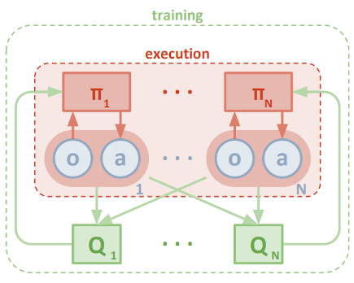
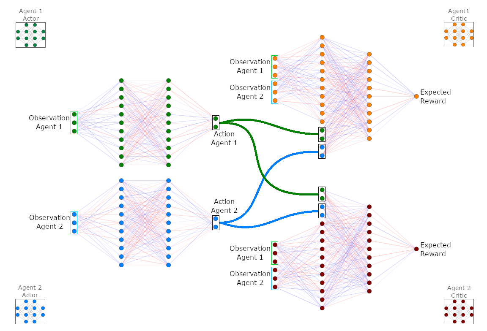
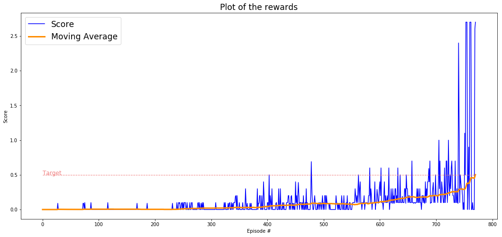
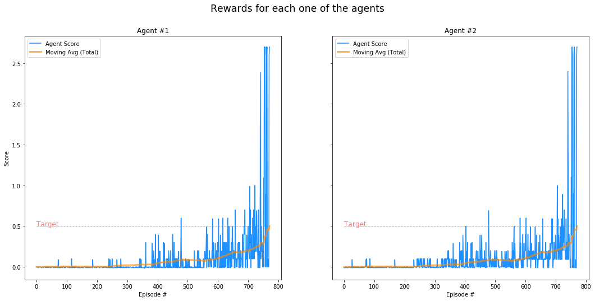
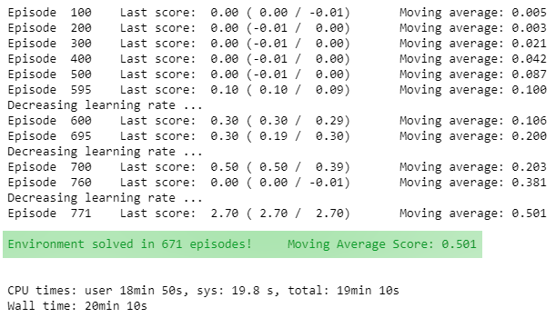
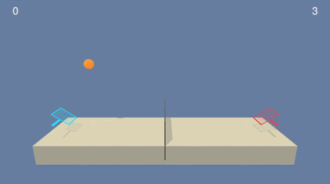
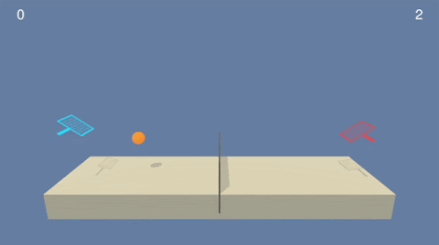

# Project 3: Collaboration and Competition

## The algorithm choice
In order to solve this challenge, I have studied and implemented the **Multi-Agent Deep Deterministic Policy Gradient (MADDPG)** algorithm, as presented in the paper [Multi-Agent Actor-Critic for Mixed Cooperative-Competitive Environments](https://arxiv.org/abs/1706.02275).  

The environment proposed in this project is composed of two agents performing similar actions according to similar observations.  
The most straightforward solution to solve this project is the implementation of only one pair of actor-critic networks. This approach could be understood to be one brain controlling two rackets. It is similar if you would be able to control one racket with each of your hands and play against yourself.  
However, I believe the enchantment of this project is training completely distinct agents who have knowledge about others and perform actions in order to collaborate and compete to reach the highest possible score.  
Thus, I opted to follow the most challenging path and training distinct agents according to the MADDPG paper.  

MADDPG does not assume that all agents have identical action and observation spaces, or act according to the same policy π. That means it is possible to train completely different agents in the same environment.  
Since each one of the agents in the environment has its private actor-critic pair of networks, they can behave in completely different manners from others as well as act following distinct goals while interacting in the same environment at the same time. As a result of that, the agents can act in collaborative or competitive settings.  

Although this project works with two agents, the implementation is flexible enough to be scaled to multiple agents.

## Centralized training with decentralized execution

As presented in the MADDPG paper, this project adapts the actor-critic method to consider action policies of other agents by adopting a centralized training with decentralized execution.  

**Decentralized execution** means that any agent has its private Actor network and takes actions considering only its observation of the environment.  

**Centralized training** means that, although each agent has its private Critic network, the critic takes as input the observations of any agent present in the environment as well as their actions in order to ease training while learning the action-value function _Q(s,a)_.  
Contrary to this algorithm, independently-learning methods perform poorly since each agent's policy changes during training, resulting in a non-stationary environment (violating Markov assumption) and preventing the naive application of experience replay (that is crucial to stabilize deep Q-learning because it breaks temporal correlation between experiences).  
Another alternative is the use of a single centralized critic for all agents, but it foils the agents to have distinct reward functions (including competitive scenarios).  

MADDPG paper presents the following figure as an overview of the multi-agent decentralized actor with centralized critic approach.  
  

## Learning algorithm

### Training function

The training function interacts with the environment to take each agent's observation of the state-space (s<sub>1</sub>, s<sub>2</sub>). Then, it sends those observations to the Multi-Agent controller in order to receive which action to take for each agent.  
At this moment, the Multi-Agent splits the observations and send them to the respective agent that returns the best-believed action to take according to its current policy _π(s) --> a_, approximated by the actor-local network. Then, the Ornstein-Uhlenbeck process is used to add noise to those actions in order to allow the exploration of the environment (each agent controls its noise process). Next, a set of actions (a<sub>1</sub>, a<sub>2</sub>) is returned to the training function.  
After receiving the action set from the Multi-Agent, the training function triggers the environment with them.  
Having performed the selected actions, the environment returns rewards (r<sub>1</sub>, r<sub>2</sub>) and next-observations (s'<sub>1</sub>, s'<sub>2</sub>).  

The experience tuple (e<sub>t</sub>) containing initial observations, actions that were taken, rewards received, and next-observations is sent to the Multi-Agent.  
At this moment, the iteration of the training loop has finished, and it is ready to start over, assuming the next-observations as the current observations.

### The replay buffer

In the last step of the training function (mentioned above), having received the experience tuple, the Multi-Agent controller stores it in a single replay buffer _D_.  

>D<sub>t</sub> = {e<sup>1</sup>, ..., e<sup>t</sup>}  
>e<sup>t</sup> = ((s<sup>t</sup><sub>1</sub>, s<sup>t</sup><sub>2</sub>), (a<sup>t</sup><sub>1</sub>, a<sup>t</sup><sub>2</sub>), (r<sup>t</sup><sub>1</sub>, r<sup>t</sup><sub>2</sub>), (s'<sup>t</sup><sub>1</sub>, s'<sup>t</sup><sub>2</sub>))

### The update of the networks' weights

Once there are experiences enough stored in the replay buffer, the Multi-Agent takes one minibatch of experiences, drawn uniformly at random, to perform the update of the networks' weights. This process is executed **once for each agent**.  
Notice that each agent's critic network receives states and actions of all agents present in the environment. That is how the critic acquires knowledge about other agents' policies. That is what defines the **centralized training**.  

#### Critic-local update: Mean Squared Error Loss
  
For each one of the experiences in the minibatch, the Multi-Agent calculates the error between target and predicted rewards.  

The **target reward _y_** for one experience is calculated using the critic-target _Q<sup>μ'</sup>_ and actor-target _μ'_ networks. Each next-observation (s'<sub>1</sub>, s'<sub>2</sub>) in the experience tuple is passed into the respective agent's actor-target network _μ'_ to predict which action should be taken (a'<sub>1</sub>, a'<sub>2</sub>). Then, this set of next-actions is passed into the critic-target network _Q<sup>μ'</sup>_ along with the next-states: _Q<sup>μ'</sup><sub>i</sub>(s'<sub>1</sub>,s'<sub>2</sub>,a'<sub>1</sub>,a'<sub>2</sub>)_. The output of this network is the predicted expected reward for the next-observations, which is multiplied by a factor γ. The final result is the discounted expected reward, which is summed up with the reward (r<sub>i</sub>) of this agent for this experience, **resulting in the target reward _y_**.  

The **predicted reward** for that experience is calculated using the critic-local network _Q<sup>μ</sup>_. The observation (s<sub>i</sub>) in the experience tuple corresponding to the agent that is being trained in this iteration is passed into the critic-local network along with any actor's action (a<sub>1</sub>,a<sub>2</sub>) in the experience tuple.  

The **error** for this experience is the difference between the target and predict rewards.  

Then, those errors are squared, and the **loss _L_** is the mean of those squared errors (Mean Squared Error Loss: MSE Loss) for all experience tuples in the minibatch. This loss _L_ (MSE Loss) is used to update the weights of the critic-local network.

> _L_ = E<sub>s,a,r,s'</sub>[(Q<sup>μ</sup><sub>i</sub>(s<sub>1</sub>,s<sub>2</sub>,a<sub>1</sub>,a<sub>2</sub>) - y)<sup>2</sup>]  
>
> y = r<sub>i</sub> + γQ<sup>μ'</sup><sub>i</sub>(s'<sub>1</sub>,s'<sub>2</sub>,a'<sub>1</sub>,a'<sub>2</sub>) | <sub>a'<sub>j</sub>=μ'<sub>j</sub>(s'<sub>j</sub>)</sub>

#### Actor-local update: policy gradient

The actor-local network _μ_ update is done applying the chain rule to the **expected return** calculated by the recently updated critic-local network _Q<sup>μ</sup>_.  

To calculate the **expected return**, for each experience in the minibatch, each observation (s<sub>1</sub>, s<sub>2</sub>) in the experience tuple is passed into the respective agent's actor-local network _μ_ to predict which action would be taken. Then, this set of actions (a<sub>1</sub>, a<sub>2</sub>) is passed into the critic-local network _Qμ_ along with the states: _Q<sup>μ</sup><sub>i</sub>(s<sub>1</sub>,s<sub>2</sub>,a<sub>1</sub>,a<sub>2</sub>)_. The output of this network is the expected return.  

The loss used to update the weights of the actor-local network is the mean of all expected returns for the experiences in the minibatch.  
> expected return = Q<sup>μ</sup><sub>i</sub>(s<sub>1</sub>,s<sub>2</sub>,a<sub>1</sub>,a<sub>2</sub>) | <sub>a<sub>j</sub>=μ<sub>j</sub>(s<sub>j</sub>)</sub>

#### Critic-target and Actor-target: soft-update

Following the update of the agents' local networks, the target networks are updated by having them slowly track the learned networks. That may slow learning since the target network delays the propagation of value estimations. However, this improves the stability of learning.  

> θ' = τ * θ + (1 - τ) * θ'  
> 
> θ' --> target weights  
> θ --> local weights  
> τ --> multiplicative factor


## Network architecture  

### Network input

The observation space consists of 8 variables corresponding to the position and velocity of the ball and racket. Each agent receives its own, local observation.  
In order to keep track of multiple observations into the past, this environment stacks 3 vector observations, allowing their comparison over time.  Thus, each agent receives a vector of observation containing 24 variables, representing the current observation along with the last two.  
The networks in this project receive as input 24 variables, owing to the fact that I opted to work with all three vector observations instead of only the current one.

### Actor and Critic networks

The **Actor Network** receives as input **24** variables representing the observed state-space and generates as output **2** numbers representing the predicted best action for that observation. That means, the Actor is used to approximate the optimal policy _π_ deterministically.

The **Critic Network** receives as input **48** variables representing the observed state-space of both agents (24 variables each). The result of the Critic's first hidden layer and the actions proceeding from any Actor Network are stacked to be passed in as input for the Critic's second hidden layer.  
The output of this network is the prediction of the target value based on the observations and estimated best actions for both agents.
That means, the Critic calculates the optimal action-value function _Q(s, a)_ by using all agents' observations and best-believed actions. That is what defines it as a **centralized critic**.  

The following figure illustrates the network architecture.  
  

### Target and local networks

Although it is not represented in the figure above, any network in this model is duplicated as local and target networks.  
This approach was introduced in the [DQN paper](https://storage.googleapis.com/deepmind-media/dqn/DQNNaturePaper.pdf), aiming to reduce the correlations with the target values.  
The use of target and local networks are described in the section 'Learning algorithm'.

### Batch normalization

I applied batch normalization to the critic network soon after concatenating the first hidden layer output with the actions. Since the numbers representing the actions are taken in the range [-1, 1], applying batch normalization at this moment prevents these numbers to be discrepant for the others.  

In addition to that, I performed some tests applying batch normalization to all Actor's layers as well as to the input variables. However, I did not notice an improvement in the learning process. On the contrary, this prevented my model from converging. So, I opted to advance without this.

## Training phase and hyperparameters

### Collaboration and competition

Since the architecture developed in this project allows agents to have distinct reward functions, and consequently distinct goals, the agents can act competitively or collaboratively. They act competitively if they receive rewards based exclusively on their actions. On another hand, they can act collaboratively if all agents receive the same rewards based on all agents' actions.  

I tested both scenarios, and the competitive setting produced better agents. They would look eagerly to perform the best action possible for earning a greater reward.
In the collaborative setting, where I added the rewards received by any agent to produce one single reward, it seems that somehow, the agents did not care much about their actions once they still received some rewards as a result of the other agent's work.

### Neural Networks

I tried distinct values for the networks' depth and size, such as [512, 512], [512, 256], [512, 256, 128], [400, 300], [128, 128], [128, 64], [64, 64, 64], [64, 32], [32, 32], [32, 32, 32]. In the end, I concluded that a small network would perform better for this challenge. So, I ended up with two hidden layers, 64 nodes each one, for both Actor and Critic networks. Coincidentally or not, this is the same configuration mentioned in the MADDPG paper.  

### Minibatches

The paper uses minibatches with a size of 1024, and update the networks after every 100 samples added to the replay buffer.  
I tried this setting, but I did not have good results. Thus, I changed these values along with the learning rates, testing minibatches of size 512, 128, 64, and 32.    
In addition to that, I tried to train more than one minibatch for each new sample as well as other configurations such as training 10 times after every 20 new samples or training 20 times after every 10 new samples.  
The best results I got were using minibatches of size 64, and training after every single sample added to the replay buffer.

### Learning rate and soft-update

As far as the learning rate goes, the MADDPG paper mentions the use of the value 0.01, combined with the soft-update multiplier tau as 0.01.  
I tested several values for these parameters, along with those minibatch and network sizes mentioned above.  
Many of them were too strong or too weak to make my model converge. So, I tailored them doing tiny changes, one value at each time.  
The setting that reached the best result was learning rates of 0.003 to the actor and 0.0004 for the critic, as well as tau of 0.008 for the soft-update.  

### Learning rate scheduler

Nonetheless, by analyzing the plot of rewards, I realized that, at some point, the agents would oscillate in getting better rewards. It was clear that the learning rate would become too strong later in the training phase.  
The solution for this issue was adding schedulers to the learning rates, decaying them by a rate of 0.2 as soon as the moving average of rewards reached the levels of 0.1, 0.2, and 0.4.  
This feature allowed my model to train smoothly, as can be verified in the mean average line, in the plot of rewards (in the next section).  

### Replay buffer size

Concerning the replay buffer size, I tried to adjust it to hold experiences of only some last episodes, such as the 100 or 200 last episodes. I took this decision based on my perception that the most recent experiences were more important than the older ones because the agents had already learned with those past experiences. This thought was not confirmed in practice, so I increased the replay buffer capacity. In the end, considering the number of episodes my model solved the environment, the replay buffer was big enough to hold all the experiences since the first one. Its size was fixed at 1,000,000.  

### Prioritized experience replay

Not satisfied with the results reached decreasing the buffer size and still believing that some experiences were more important than others, I implemented a prioritized experience replay in accordance with [this paper](https://arxiv.org/abs/1511.05952).  
Since the experiences are prioritized based on the temporal difference error, the experiences need one prioritization per agent. So, I also did this change in the original algorithm.  
In spite of my effort, the use of prioritized experiences did not help the training. Hence, I discarded those changes and did not include this feature in my code.  

### Discounted rewards

To the discounted reward factor (gamma), the best value found was 0.99, which gives importance for around 100 rewards ahead.  
Other values such as 0.985, 0.98, 0.97, and 0.95 were also tested.  

### Noise process

Every time I added noise to the actions, it would mess up the learning process. In view of that, I performed several tests without noise interference. When I could stabilize the training phase with the other hyperparameters, I started adding some noise while decreasing its weight over the actions. Then, I reached a quite low value that would not change too much the actions but still permitted some exploration. The best values found were theta as 0.9 and sigma as 0.01.

### Random seed

Another hyperparameter that made a great difference in the learning process was the number used to initialize the pseudorandom number generator.  
I tested all values lower than 14 as well as some greater prime numbers.  
In combination with other hyperparameters, I found the best seed as 997.

### Final setting
Summing up, these were the values defined for the hyperparameters:

```
seed: 997
actor_layers: [64, 64]
critic_layers: [64, 64]
actor_lr: 0.003
critic_lr: 0.0004
lr scheduler decay: 0.2
lr scheduler steps at: 0.1, 0.2, 0.4
buffer_size: 1000000
batch_size: 64
gamma: 0.99
tau: 0.008
noise_theta: 0.9
noise_sigma: 0.01
```

## Conclusion

Having studied and worked hard in this project, I could develop and train **two distinct agents** to control rackets and play tennis with each other.  

The amount of attention allocated in implementing the algorithm correctly and in tailoring the hyperparameters during the training phase resulted in a smooth learning curve and relatively fast training.  

Admittedly, other algorithms might converge faster than this one, for example, the use of only one pair of actor-critic networks. However, compared to other implementations of MADDPG algorithms, my implementation converged truly fast.

Have said that, as I can see, the number of episodes performed to solve the environment was not the point for this project.  
Instead, in this challenge, I opted to build a robust model that has completely independent agents, is scalable to train and perform with several agents at the same time, present a consistent training curve, and still train fast.

Finally, as demonstrated in this report and evidenced in the plot of rewards below, **I successfully accomplish the objectives of this challenge!**


## Plot of the rewards

This graph shows the rewards per episode within the training phase, as well as the moving average.  
It illustrates that the agents were able to receive a moving average reward of at least 0.5 points over 100 episodes.  

  

The next graphs show the rewards per episode for each one of the agents individually within the training phase.  
It illustrates that, at the end of the training phase, each agent was able to receive the maximum reward possible within one episode: 2.7 points each.



The logs below show the progression of the training phase.  



## Trained Agent
In the GIFs below, you can watch the trained agents and compare them with untrained ones.  

**Trained Agent**  
  

**Untrained Agents**  



## Ideas for Future Work

1. Although I have spent a great deal of time tailoring the hyperparameters, there may be other sets of values that conduce the agents to solve the environment even faster. Thus, more tests might be performed to verify that.  

2. Other noise process algorithms might be tested to evaluate if the environment exploration would be better. In addition to that, a scheduler would be introduced to decay the noise over time.

3. MADDPG paper, as well as this project, uses minibatches taken uniformly from the replay buffer. Even though I have tested some implementations of prioritized experiences, one future work might explore deeper this approach.

4. Negative rewards could be introduced to discourage the agents from taking aleatory moves away from its goal.

5. The goal for this project was getting a reward of +0.5 over 100 consecutive episodes. Other tests might verify if this architecture can solve the same environment with a higher target score.

6. MADDPG paper introduces a training regimen utilizing an ensemble of policies for each agent that leads to more robust multi-agent polices. This point was not explored in this project and might be pursued in the future.

